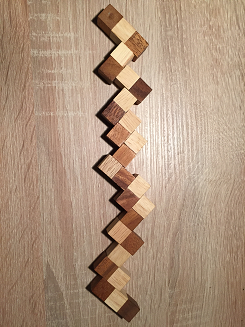
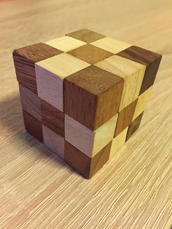
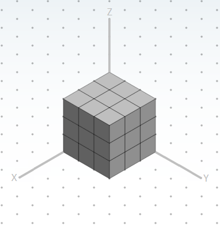

============================
Snake-Cube-Puzzle
============================

Simple program that calculates the steps to turn this snake:

 

into this cube:

 

----------------------------------
How to build and run the program
----------------------------------
```
make
./snake-cube-puzzle
```

The solution is calculated using the following coordinate system:


